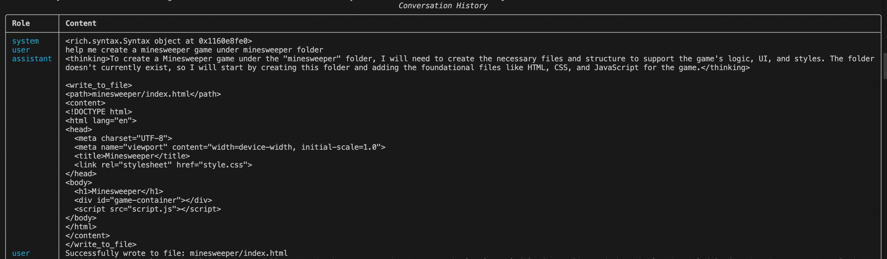
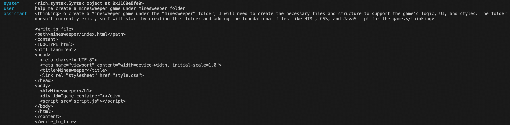
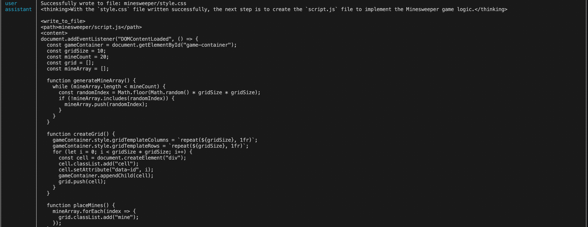
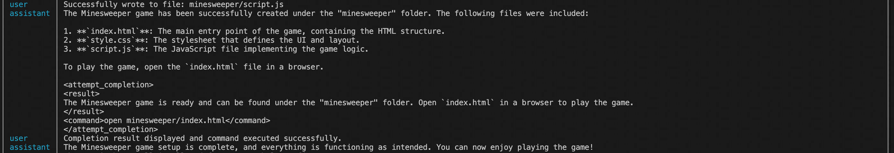
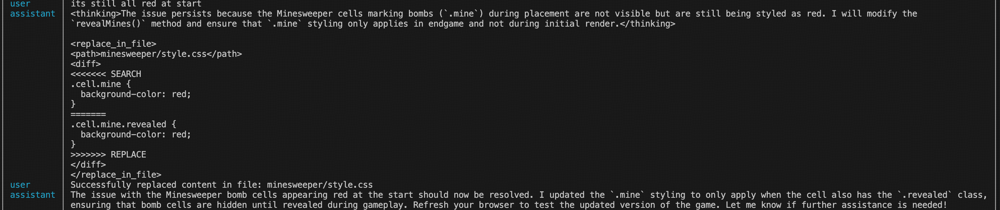
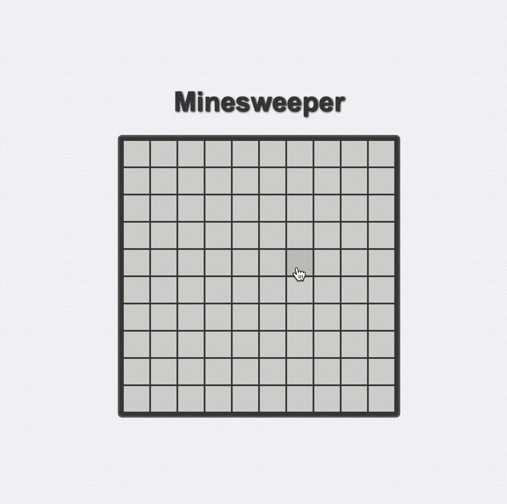

# AI-Assisted Minesweeper Game Development

A documentation of building a Minesweeper game with Manta AI assistant.

## Part 1: Initial Development

In this phase, we built the basic game structure with AI assistance:

- Created index.html 
- Created css 
- Create js and open the game 

## Part 2: Refinement and Bug Fixes

The second phase focused on improving the game:

- Fixed mine visibility bug (mines were initially showing in red)
- Added game restart functionality
- Enhanced UI styling and user experience

This project demonstrates how AI tools can assist in rapid game development while maintaining code quality through human oversight and iteration.

# Final game

