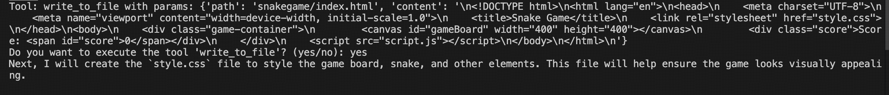
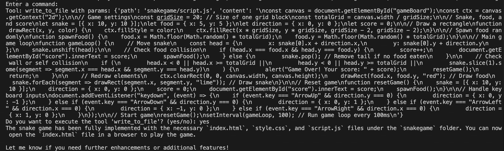
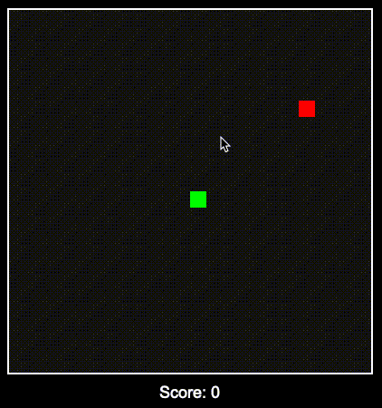

# AI-Assisted Snake Game Creation

这是一个通过 AI 助手（Manta）开发的经典贪吃蛇游戏项目。本项目展示了如何利用 AI 技术高效地构建一个网页游戏，整个开发过程简洁明了，充分展现了 AI 辅助开发的优势。

## 技术栈

项目采用原生 Web 技术开发，无需任何外部依赖：
- HTML5 Canvas 用于游戏渲染
- CSS3 实现界面样式
- 原生 JavaScript 处理游戏逻辑

## 项目结构

项目采用简洁的三文件结构：
```
snakegame/
├── index.html    # 游戏主页面
├── style.css     # 样式文件
└── script.js     # 游戏逻辑
```

## 开发流程展示

下面详细记录了与 AI 助手协作开发的完整过程：

### 1. 项目启动
首先向 AI 提出开发需求，明确项目目标。


### 2. AI 规划
AI 助手提供了清晰的开发计划，列出了必要的步骤和文件结构。


### 3. 开发过程
通过简单的交互，AI 开始逐步实现游戏功能：

#### HTML 文件创建
AI 创建了基础的游戏页面结构，并主动规划下一步工作。我们这里就不用输入任何内容了，直接回车让ai继续工作，当然这里也可以告诉ai “当然你继续”



#### CSS 样式设计
在得到确认后，AI 继续完成样式文件的创建。


#### JavaScript 逻辑实现
最后，AI 完成了游戏核心逻辑的编写。


### 4. 项目完成
游戏文件创建完成后，通过简单的命令即可运行游戏。


## 游戏运行效果

使用 `open index.html` 命令即可在浏览器中打开游戏，展现出简洁而完整的游戏界面。


## 致谢

特别感谢 Manta AI 助手在整个开发过程中提供的专业指导和高效协作。这个项目很好地展示了 AI 辅助开发的潜力，通过简单的对话即可完成一个完整的游戏开发。
