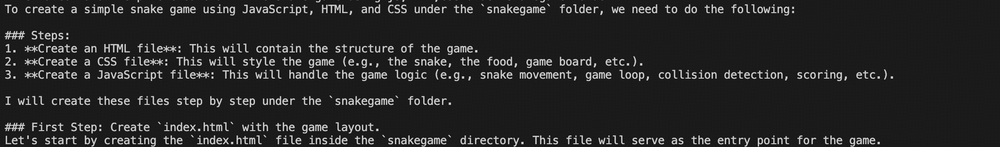
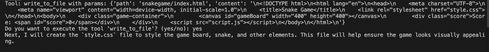
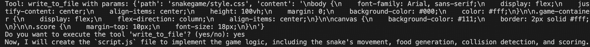
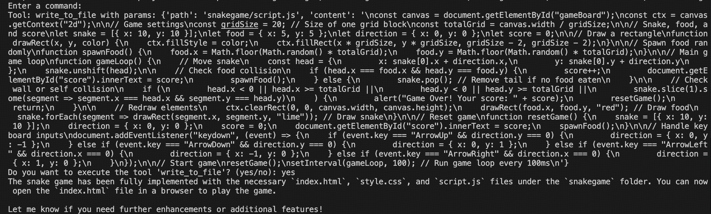
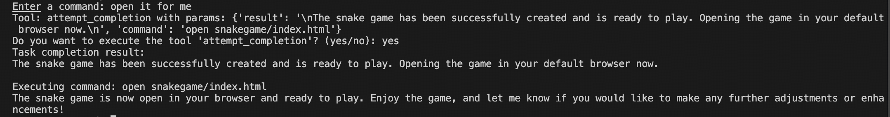
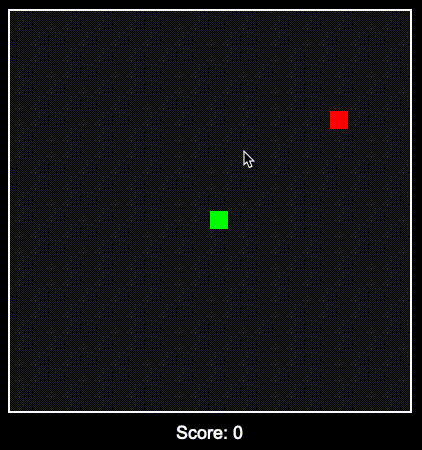

# AI-Assisted Snake Game Creation

This is a classic Snake game project developed with the assistance of an AI agent (MantaCoder). The project demonstrates how to efficiently build a web-based game using AI technology, showcasing the advantages of AI-assisted development through a clear and concise development process.

## Technology Stack

The project is developed using native Web technologies without any external dependencies:
- HTML5 Canvas for game rendering
- CSS3 for interface styling
- Native JavaScript for game logic

## Project Structure

The project follows a simple three-file structure:
```
snakegame/
├── index.html    # Main game page
├── style.css     # Styling file
└── script.js     # Game logic
```

## Development Process Showcase

Below is a detailed record of the complete development process in collaboration with the AI assistant:

### 1. Project Initiation
First, we presented the development requirements to the AI and clarified the project objectives.


### 2. AI Planning
The AI assistant provided a clear development plan, outlining the necessary steps and file structure.


### 3. Development Process
Through simple interactions, the AI began implementing game features step by step:

#### HTML File Creation
The AI created the basic game page structure and proactively planned the next steps. At this point, we could either simply press enter to let the AI continue working or explicitly confirm with "Please continue."



#### CSS Style Design
After confirmation, the AI proceeded to create the style file.



#### JavaScript Logic Implementation
Finally, the AI completed the core game logic implementation.


### 4. Project Completion
Once the game files were created, the game could be run with a simple command.


## Game Running Effect

Use the `open index.html` command to open the game in a browser, displaying a clean and complete game interface.


## Acknowledgments

Special thanks to the MantaCoder AI assistant for providing professional guidance and efficient collaboration throughout the development process. This project excellently demonstrates the potential of AI-assisted development, showing how a complete game can be developed through simple dialogue interactions.
